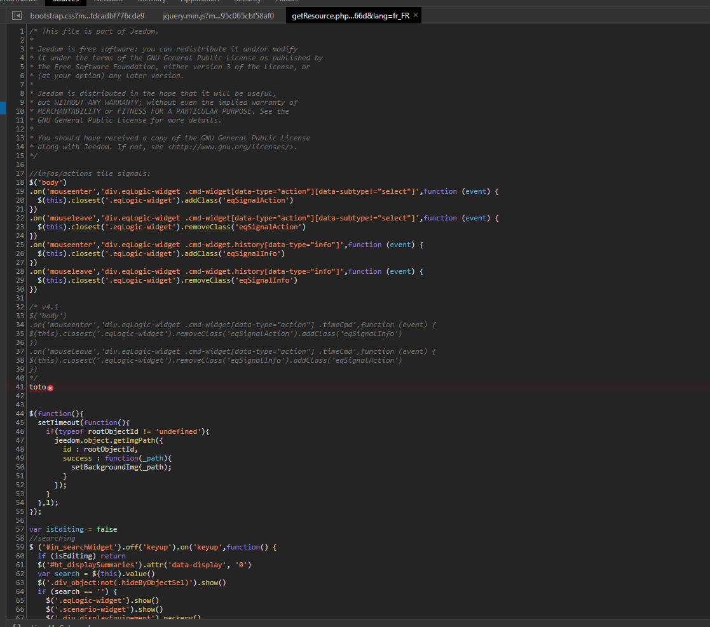

# Comment remonter un bug ?

Il existe dans Jeedom plusieurs maniere de remonter un soucis : 

- remonter le soucis sur la [communautée](https://community.jeedom.com), c'est en géneral la que vous aurez la réponse la plus rapide
- remonter un soucis à l'équipe Jeedom : 
-- **Demande de support** (nécessite un service pack power ou plus ou bien que le soucis soit sur un plugin/service payant), cette demande est **privée** et vous mettra directement en relation avec l'équipe support de Jeedom qui analyse votre cas en particulier
-- **Rapport de bug**, dans ce cas la demande est **public** et sera posté sur la communauté
-- **Demande d'amélioration**, dans ce cas la demande est **public** et sera posté sur la communauté

>**NOTE**
>
>Dans le cas d'une demande de support sur un plugin tierce un mail est envoyé au developpeur du plugin

>**IMPORTANT**
>
>Tous le support se passe uniquement par mail, il n'y a pas d'autre possibilité, attention a bien surveiller vos spams, souvent le support répond rapidement (délai avant réponse en moyenne de moins 72h, attention en fonction du probleme cela peut etre beaucoup plus long)

# Quelles informations envoyer pour avoir une solution le plus rapidement possible

Quelque soit la méthode utilisée pour remonter le soucis il est vraiment important de donner le plus d'information possible, plus de 80% des demandes ont pour 1er réponse : "pouvez vous détailler votre soucis ?". Pour rappel on ne voit pas votre ecran, on a aucun historique de ce que vous avez fait comme manipulatio et on a pas forcement le meme vocabulaire que vous...

Pour vous aider voila ce qu'il faut faire : 

- Votre soucis concerne un probleme d'affichage graphique (widget, page, champs texte...), meme si ca parait evident pour vous lors de l'explication mettez une capture d'ecran (possible que sur le communuity ou il est possible de copier l'image directement), ca prend 30s pour vous et ca fera gagner plusieurs dizaine de minute à la personne qui essaye de vous aider à résoudre votre soucis
- Vous avez une erreur "500", la mettez directement le fichier http.error (ça se trouve dans Analyse -> Logs), sans ca de toute facon il sera impossible de savoir d'ou vient le soucis (pas oublier que nous n'avons aucun(e) voyant(e) chez jeedom ou parmis les developpeurs tierce)
- Vous avez une erreur javascript (panneau warning en haut a droite) ou quand vous faite F12 puis console une ligne rouge. Dans ce cas il faut : deja donner le message d'erreur complet en question, mais dans 99% des cas ca sera trop vague pour qu'on comprenne le soucis. Il faut donc faire F12 cliquer sur console puis reproduire à nous le soucis (en generale en rafraichissant la page puis si ca suffit pas en refaisant les meme action), vous allez normalement avoir à nouveau le message d'erreur mais cette fois il faudra cliquer en bout de ligne (ca peut etre soit comme sur la capture ci-dessous soit sous la forme VMXXX.js) : 

Puis faire une capture de ce qui va s'afficher, en particulier la ligne en rouge : 

Voila si vous suivez bien tout ca vous devriez avoir des réponses a votre probleme bien plus rapide et bien plus juste et permettre à la personne qui vous a aider d'aider une autre personne plus rapidement.
